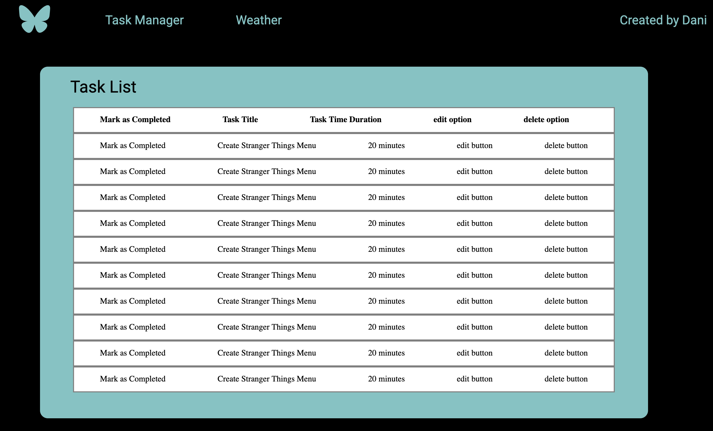
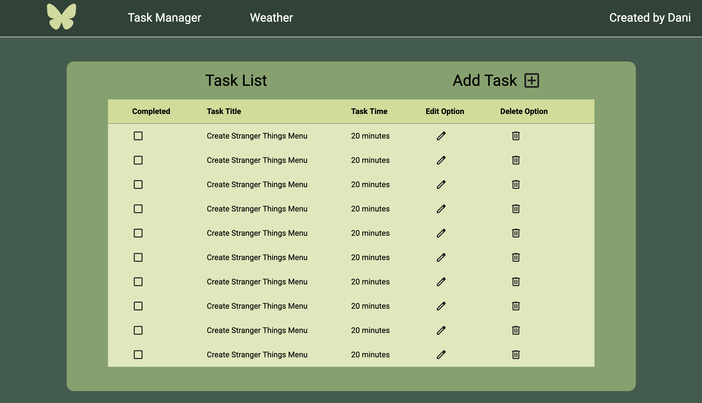

## Todolist Application (Spring & Angular)

### About me

Hello, my name is Daniel Nager Carpio. If you’ve made it here, I’d like to thank you for reviewing my portfolio. Whether you’re a recruiter or just interested in the project — thanks for being here.

### About project

Last week, I had the idea to implement a to-do list app — a basic application that every developer can start with. My intention was to make it a bit more challenging than its original purpose. I wanted to push my limits and improve the app by using GitHub pull requests, working with branches, setting up GitHub Actions (where you can download the .jar 😄), and other things like improving my Angular and Spring knowledge, learning about design patterns, and exploring additional topics.

### How to work with it

To run project when you had cloned it into your local machine, you have to do two things:

1. Run the project backend.

- To install the backend maven dependencies make mvnw executable and then ./mvnw clean install.
- To run the project do: ./mvnw spring-boot:run

2. Run the project frontend.

- First of all, npm install.
- Second step is to serve the frontend throgh ng serve command.

### Image of application

- First Version of todo list App (frontend not working yet)
  
- Second Version of todo list App (frontend not working yet)
  

## Example of run

Save task example

